# Sina_Weibo_APP
这是一个第三方的新浪微博安卓APP。
由于时间问题，这个APP还存在着许多各种各样的问题。
事实上，这个APP还没有向新浪官方提交，因此目前只有测试用户可以正常使用。如果您要测试相关功能，则需要修改Constants.java文件。
如果您也在试图开发第三方新浪微博客户端，并且有相关的问题需要讨论，可以给我发邮件：ldkyh@163.com

# Screenshot

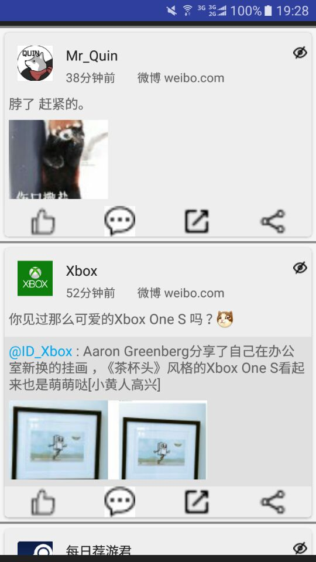
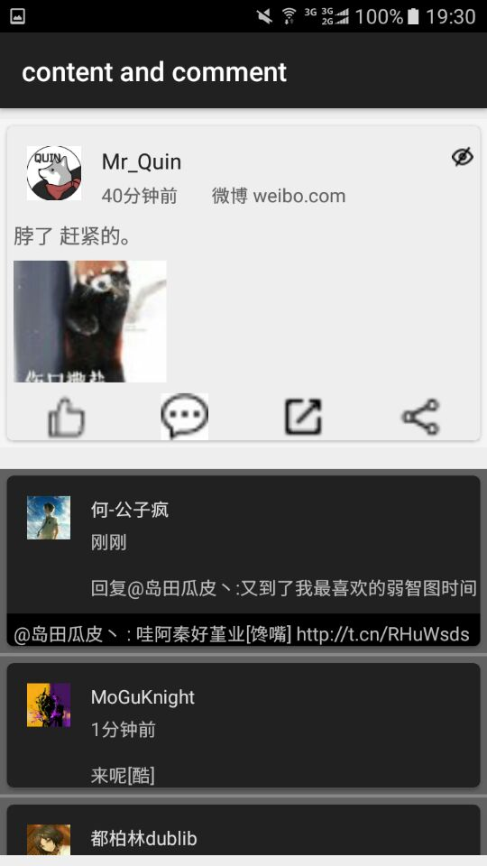
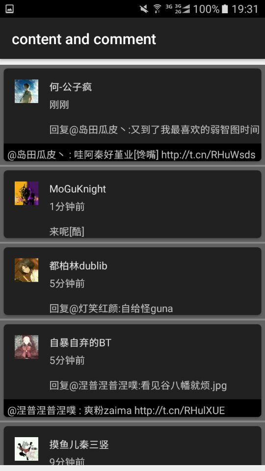
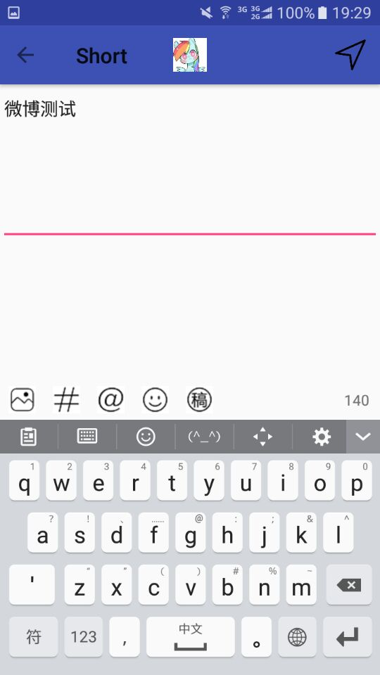
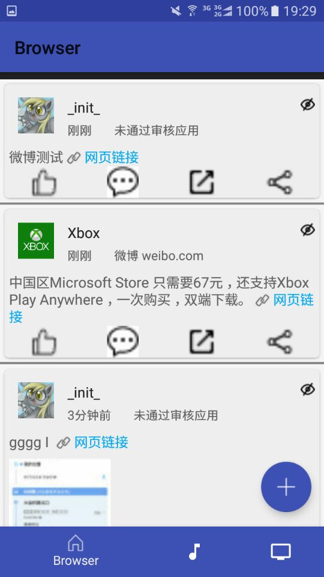
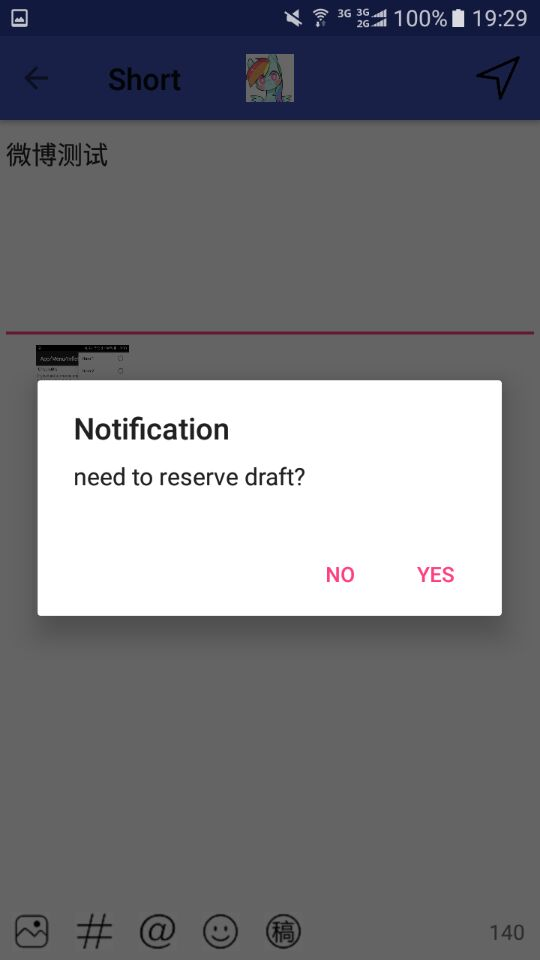
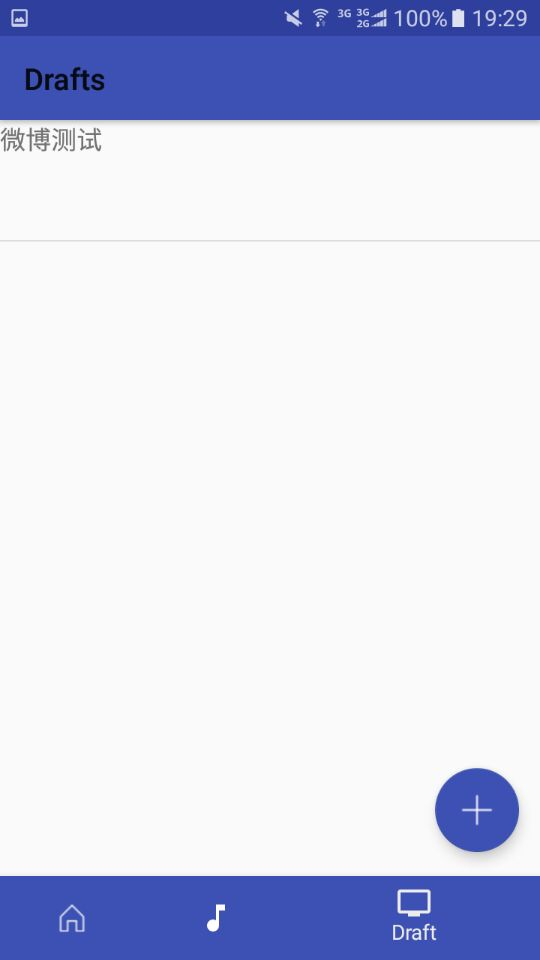
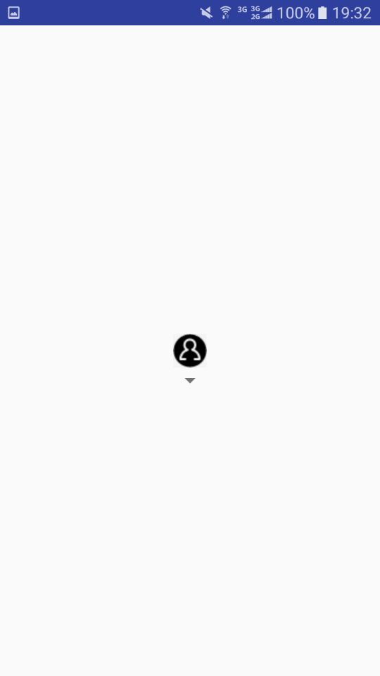
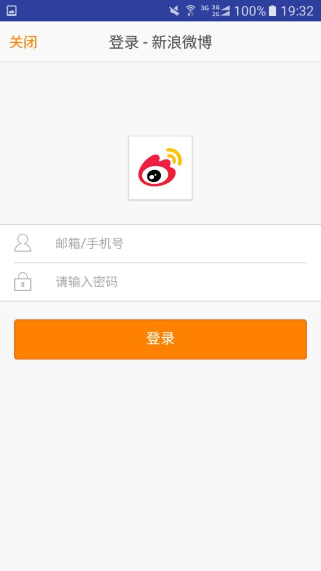
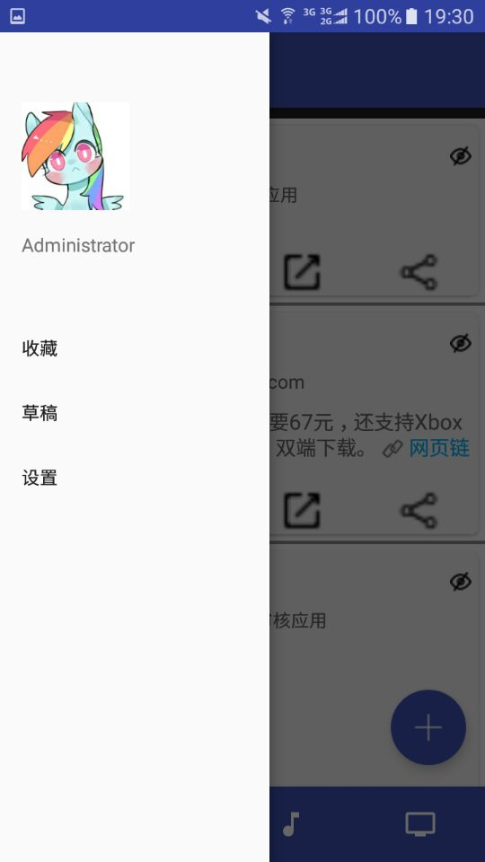
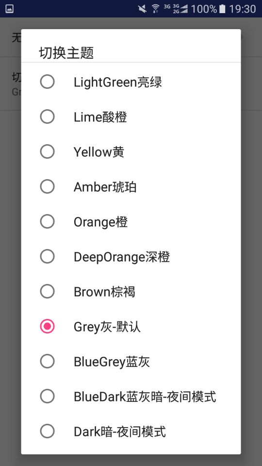

# Thanks

本项目受到了以下开源项目的帮助

Here is the libraries

- [EasyRecyclerView](https://github.com/Jude95/EasyRecyclerView)
